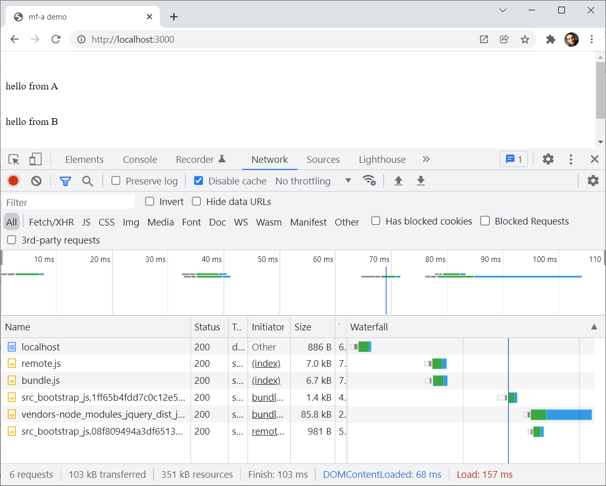

# Experiment with webpack module federation

This examples shows two different JavaScript packages which do not know about
each other or depend on each other but share the same dependency `jQuery`.
Including both bundles in a html file - one bundle as host (`bundle.js`) the
other as remote (`remote.js`) - should not make the `jQuery` dependency be
loaded twice.


## How to run

There are two packages: ``mf-a`` and ``mf-b``.
Both use jQuery and do a super simple thing with it.

In `mf-a` do:

```shell
cd mf-a
npx yarn install
npx yarn start
```

In `mf-b` do:

```shell
cd mf-b
npx yarn install
npx yarn start
```

Start a webbrowser with the URL: http://localhost:3001/

When visiting the network tab in the developer console you should see only one
jQuery instance be loaded.


## Docs

https://webpack.js.org/concepts/module-federation/
https://webpack.js.org/plugins/module-federation-plugin/


## Solution

We need to distinguish between **two roles** of apps: the **host (aka shell)** and the **remote (=plugin)**. In this example, mf-a acts as the host and mf-b acts as the remote.

1. In the remote, expose metadata (remote entry via ``filename`` property) and expose modules that can be loaded into the host:
    https://github.com/manfredsteyer/plugin-demo/blob/main/mf-b/webpack.config.js#L23

2. In the host's ``index.html``, load the remote entry files of the remotes in question. This gives the host the needed meta data for deciding about which versions of shared libraries to load (e. g. highest compatible version = highest minor version)
    https://github.com/manfredsteyer/plugin-demo/blob/main/mf-a/index.html#L8

3. In the host, use the helper function ``loadRemoteModule`` to load the individual remotes on demand:
    https://github.com/manfredsteyer/plugin-demo/blob/main/mf-a/src/bundle.js#L4

    This helper function is a simple convenience wrapper around the webpack runtime API.

As the result, both, the host (mf-a) and the remote (mf-b), are loaded and jQuery is shared:


